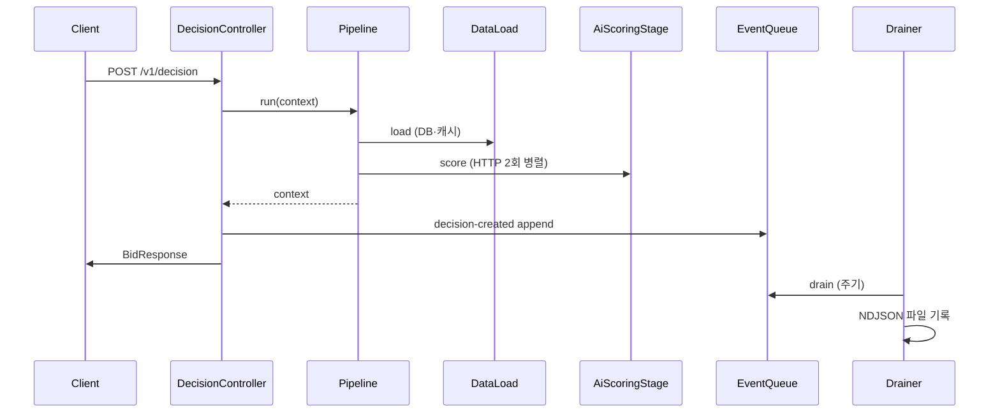

# Ad Decision Gateway (ADG)

고부하·저지연을 전제로 한 **광고 의사결정 API** 및 노출/클릭 이벤트 수집 서비스. OpenRTB 2.x 스펙 기반 DSP(Demand-Side Platform) 역할을 수행한다.

---

## 기술 스택

- **Java 21**, **Spring Boot 3.x**
- **Undertow** (Tomcat 제외), **Virtual Threads**
- **H2** (로컬), **Flyway**
- **Caffeine** (로컬 캐시), **Resilience4j** (Circuit Breaker / Retry / Bulkhead)
- **Apache HttpClient 5** (연결 풀), **Micrometer / Prometheus**, **OpenAPI** (springdoc)

상세 요구사항: [요구사항.md](요구사항.md), 에이전트/위임: [AGENTS.md](AGENTS.md).

---

## 캐싱

- **이중 CacheManager**  
  - **Primary**: creatives, policies, apps, sites, publishers — **10분 TTL**, maximumSize 1000.  
  - **Decision 전용** (`decisionCacheManager`): profiles, campaigns, policies, cap — **1분 TTL**. 파이프라인 1단계(DataLoadStage)에서 Profile/Campaign/Policy/Cap 조회 시 사용.
- 요청 경로에서 DB 부하를 줄이고, TTL을 도메인별로 나누어 지연을 예측 가능하게 했다.

---

## 동시 처리·대용량

- **Virtual Thread** (Java 21): 요청당 가상 스레드로 동시 연결 수를 늘리고, 5k RPS 목표에 맞춘다.
- **Undertow**: worker 768, IO 8, 16KB buffer — 부하 시 수락·디스패치 여유 확보.
- **HikariCP**: maximum-pool-size 150, connection-timeout 8s. **OSIV 비활성화**로 요청 경로에서 DB 커넥션 점유를 최소화.
- **Resilience4j**: Circuit Breaker / Retry / **Bulkhead(800)** — downstream 장애 시 격리·fallback.
- **Decision 응답 경로에는 DB 쓰기를 두지 않음**. 이력은 인메모리 이벤트 큐 append 후 비동기 drain으로 처리.

---

## 성능

- **목표**: Avg &lt; 50ms, P95 &lt; 100ms (로컬), 200 rps 부하 검증, 5k RPS 설정 가능.
- **HttpClient 5 연결 풀**: maxConnTotal/PerRoute 500, connect 100ms / read 300ms. 동일 호스트 재사용으로 셀프 호출·동시 호출 시 연결 폭증을 막는다.
- **이벤트 큐**: 인메모리 append 후 `@Scheduled` drain(500ms 간격, batch 500) → 파일(NDJSON). 요청 지연에 영향을 주지 않는다.

---

## 광고 도메인 적용

- **OpenRTB 2.x**: Bid Request(id, imp, site/app, device, user) 수신 → 의사결정 → Bid Response(seatbid, bid: impid, price, crid, nurl) 반환.
- **6단계 파이프라인**: **DataLoad**(DB·캐시) → RequestValidation → AdFiltering → **AiScoring**(Mock AI 엔진 2개 HTTP, 병렬·Executor 제한) → AdSelection(aiScore×bid 반영) → Exposure.
- **Fallback**: 후보 없음 또는 필터 통과 없음 시 house ad(crid=house-default) 반환.
- **Port/Adapter**: Profile, Campaign, Policy, Cap — 기본은 DB 어댑터(캐시 1분). `app.decision.use-http-dependencies: true` 시 HTTP mock으로 전환 가능.

---

## HTTP·비동기 처리

- **요청 경로(동기)**: DataLoadStage에서 Profile/Campaign/Policy/Cap은 **DB+캐시만** 사용(HTTP 없음). 지연·연결 부하를 줄였다.
- **HTTP 호출**: AiScoringStage에서 Mock AI 엔진 2개 POST를 **CompletableFuture + decisionExecutor**로 병렬 호출. “외부 서비스 호출” 샘플이며, 동시 HTTP 호출 수는 Executor로 제한한다.
- **비동기 이력**: Decision 생성 시 이벤트 큐 1건 append → EventQueueDrainer가 주기 drain → 파일. 확장 시 Kafka/Worker 연동 가능. 이력 DB 저장용 DecisionHistoryPort·BidResponsePort는 확장용으로 두었으며, 현재는 이벤트 큐→파일만 사용한다.

---

## 실행 방법

- **기동**: `./gradlew bootRun` (Windows: `.\gradlew.bat bootRun`)
- **API 문서**: http://localhost:8080/docs  
- **Decision**: `POST http://localhost:8080/v1/decision` (Body: OpenRTB 2.x Bid Request JSON)
- **부하 테스트**: [scripts/load-200rps.ps1](scripts/load-200rps.ps1) 참고

---

## 참고 문서

- [요구사항.md](요구사항.md) — 기능·비기능 정의
- [docs/decision-flow-and-requirements.md](docs/decision-flow-and-requirements.md) — Decision 흐름·성능·확장성
- [docs/package-structure.md](docs/package-structure.md) — 패키지 구조
- [docs/runbook.md](docs/runbook.md) — SLO/SLA, 로그·메트릭
