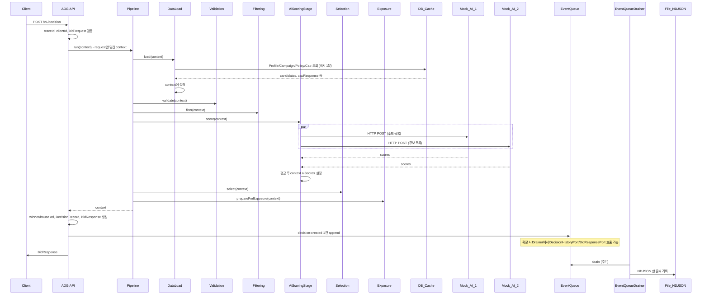

# Decision 흐름 및 요구사항 정리

요구사항(기능·비기능) 대비 Decision 구현의 상세 흐름·성능·확장성을 정리한 문서이다.

---

## 1. 목적

- **기능 요구사항**(요구사항.md 5.1)과 **비기능 요구사항**(성능, 확장성)에 맞춰 Decision API 구현이 어떻게 동작하는지 한곳에서 파악할 수 있도록 한다.
- 신규 참여자·운영·튜닝 시 참고용으로 사용한다.

---

## 2. 처리 흐름(상세)

1. **수신**  
   `POST /v1/decision` 수신. 인증 없음(OpenRTB). `TraceFilter`에서 `traceId` 설정, `AuthFilter`에서 `clientId`(미설정 시 `"openrtb"`)를 요청 속성에 넣음.

2. **입력 검증·변환**  
   OpenRTB 2.x Bid Request(Bean Validation: `id`, `imp[]` 필수) 수신 후 `OpenRtbMapper.toDecisionRequest(bidRequest)`로 `DecisionRequest` 생성. `clientId` 설정.

3. **파이프라인 실행**  
   `AdDecisionPipelineContext`에 `requestId`, `decisionId`, `traceId`, `clientId`, `request`만 담아 구성.  
   `AdDecisionPipeline.run(context)` 호출:
   - **DataLoadStage**: Profile / Campaign / Policy / Cap을 **DB·캐시(1분 TTL)**에서 조회. context에 `candidates`, `capResponse`, `profile`, `policies` 설정. (HTTP 호출 없음.)
   - **RequestValidationStage**: 요청 유효성 검증. 실패 시 예외.
   - **AdFilteringStage**: 후보 광고 필터링(정책/Cap/상태) → `filteredCandidates`.
   - **AiScoringStage**: 필터 통과 후보에 대해 Mock AI 엔진 2개 **HTTP POST** 병렬 호출(decisionExecutor 사용). 응답 점수 평균해 context에 `aiScores` 설정.
   - **AdSelectionStage**: `aiScores`와 bid를 반영해 우승자 선정 → `winner`.
   - **ExposureStage**: 노출 준비(스켈레톤에서는 시그니처 위주).

4. **응답·이력·메트릭**  
   `context.getWinner()` 없으면 house ad 사용. `DecisionRecord`·OpenRTB `BidResponse` 생성.  
   **이벤트 큐**에 `"decision-created"` 이벤트 1건 append(payload: requestId, decisionId, traceId, clientId, bidRequestJson, decisionRecordJson, bidResponseJson).  
   메트릭(`adg.decision.*`) 증가·레이턴시 기록 후 `BidResponse` 반환.

5. **이력 저장(현재 설계)**  
   **DB(decision_history, bid_responses)에는 요청 경로에서 쓰지 않는다.**  
   이력·응답 정보는 **이벤트 큐 payload**로만 보관하고, `EventQueueDrainer`가 주기적으로 drain 하여 **파일(NDJSON)** 에 한 줄씩 기록한다.  
   `DecisionHistoryPort`, `BidResponsePort`는 어댑터까지 구현되어 있으나 **현재 호출처 없음**. 확장 시 Drainer 또는 별도 Worker에서 payload를 파싱해 해당 포트를 호출해 DB에 저장할 수 있다.

---

## 3. 성능 요구사항 대응

| 요구사항 | 내용 | 적용 사항 |
|----------|------|-----------|
| 지연 | Avg &lt; 50ms, P95 &lt; 100ms (로컬 기준) | Virtual Thread, Undertow worker, 요청 경로 DB 미사용, downstream 연결 풀·타임아웃, Resilience4j |
| 처리량 | 200 rps 부하 스크립트, 5k RPS 목표 설정 가능 | `app.decision.executor`(core/max/queue), Bulkhead 800, Undertow worker 768, Hikari 풀 150 |
| 캐시 | 광고/소재 등 DB 조회 시 로컬 캐시(Caffeine) | CacheConfig·이중 CacheManager. Decision 경로는 DataLoadStage에서 DB·캐시(1분 TTL) 조회. |

**주요 설정**(application.yml 기준):

- **스레드**: Virtual Thread 활성화.
- **WAS**: Undertow worker 768, buffer 16KB.
- **DB 풀**: Hikari maximum-pool-size 150, connection-timeout 8000.
- **HTTP 클라이언트**: `app.http.connect-timeout-ms` 100, `read-timeout-ms` 300. RestTemplate은 Apache HttpClient 5 연결 풀(maxConnTotal/PerRoute 기본 500).
- **Decision Executor**: `app.decision.executor` core 600, max 800, queue 4096. AiScoringStage에서 AI 엔진 HTTP 병렬 호출 수 제한용. (Resilience4j Bulkhead는 HTTP 어댑터 사용 시 적용.)
- **이벤트 큐**: 요청 경로에서는 in-memory append만 수행. Drainer가 비동기로 파일 기록 → 요청 지연에 영향 최소화.

**부하 스크립트**: [scripts/load-200rps.ps1](../scripts/load-200rps.ps1). 동시 100 + mock 셀프 호출 시 지연 가능하므로 클라이언트 타임아웃(TimeoutSec) 30초 등으로 설정 가능.

---

## 4. 확장성

- **파이프라인**: 6단계(DataLoad → Validation → Filter → AiScoring → Selection → Exposure). 각 Stage는 인터페이스로 정의되어 구현체 교체·단계 추가가 가능하다. [ADR 004](adr/004-decision-pipeline.md) 참조.
- **Port/Adapter**: Downstream(Profile, Campaign, Policy, Cap), 이벤트 큐(EventQueuePort) 사용 중. DecisionHistoryPort, BidResponsePort는 확장 시 Drainer/Worker에서 이벤트 payload 기반으로 호출해 DB 저장 연동 가능.
- **설정**: `app.http.*`(연결 풀·타임아웃), `app.decision.executor.*`, Resilience4j(Timeout/Retry/Circuit/Bulkhead), 캐시(Caffeine)는 application.yml 및 [package-structure.md](package-structure.md) 참조.

---

## 5. 참조

- [요구사항.md](../요구사항.md) — 5.1 Decision API, 비기능 1(성능), 7(유지보수/확장성)
- [docs/adr/004-decision-pipeline.md](adr/004-decision-pipeline.md) — 4단계 파이프라인 ADR
- [docs/diagrams/decision-flow.mmd](diagrams/decision-flow.mmd) — Decision 흐름 다이어그램
- [docs/runbook.md](runbook.md) — SLO/SLA, 알람, 로그·메트릭 가이드
