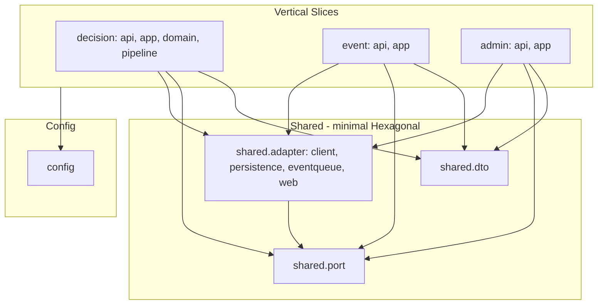

# ADG 패키지 구조 가이드

이 문서는 ADG(Ad Decision Gateway) 프로젝트의 **Vertical Slice + 최소 Hexagonal** 하이브리드 패키지 구조를 설명한다. 새 기능 추가 시 코드 위치 판단에 참고한다.

---

## 1. 구조 원칙

### 1.1 Vertical Slice

- **기능(Decision / Event / Admin)** 단위로 **진입점(API)** 과 **유스케이스(app)** 를 한 슬라이스에 모은다.
- “한 기능을 수정할 때 갈 패키지”가 명확해진다: Decision 수정 → `decision.*`, Event 수정 → `event.*`, Admin 수정 → `admin.*`.

### 1.2 최소 Hexagonal (공유)

- 여러 슬라이스가 공유하는 **외부 연동**(Profile/Campaign/Policy/Cap, DB, 이벤트 큐)은 **공유 포트(인터페이스)** 와 **공유 어댑터**에 둔다.
- Mock/실제 교체와 테스트 용이성은 유지한다.

### 1.3 요구사항 반영

| 요구사항 | 반영 |
|----------|------|
| Port/Adapter로 의존성 교체 가능 | `shared.port` + `shared.adapter` (client, persistence, eventqueue, web). |
| 모듈 경계 유지 | 슬라이스(decision/event/admin)는 `shared`만 의존; `shared`는 config만 추가 참조. |
| 기능 경계: Decision / Event / Policy·Admin | `decision.*`, `event.*`, `admin.*` 로 분리. |

---

## 2. 구조 다이어그램



---

## 3. 패키지 트리

```
com.adg
├── AdDecisionGatewayApplication.java
├── config/                              # 크로스커팅 (인증, HTTP, 메트릭, 로깅, 캐시)
│   ├── AppAuthProperties, RestTemplateConfig, AdgMetrics, SwaggerRedirectConfig, CacheConfig
│   └── logging/KafkaLogbackAppender
├── shared/                              # 공유 (최소 Hexagonal)
│   ├── dto/                             # API·연동용 요청/응답 DTO
│   ├── port/                            # 외부 연동 인터페이스 (Profile, Campaign, Policy, Cap, DecisionHistory, EventQueuePort)
│   ├── util/                            # SensitiveDataMasker 등
│   └── adapter/
│       ├── client/                      # Profile, Campaign, Policy, Cap HTTP 클라이언트
│       ├── persistence/                 # JPA Entity, Repository, *PortAdapter
│       ├── eventqueue/                   # InMemoryEventQueue, InMemoryEventQueueAdapter, EventQueueDrainer, EventQueueFileWriter, EventQueueHealthIndicator, EventQueueShutdownHandler
│       └── web/                         # AuthFilter, TraceFilter, RequestLoggingFilter, GlobalExceptionHandler, mock/*
├── decision/                            # Decision 슬라이스
│   ├── api/                             # DecisionController
│   ├── app/                             # DecisionService
│   ├── domain/                          # CampaignFilter, WinnerSelector
│   └── pipeline/                        # 4단계 파이프라인 (확장 가능)
│       ├── AdDecisionPipelineContext, AdDecisionPipeline
│       ├── RequestValidationStage, AdFilteringStage, AdSelectionStage, ExposureStage
│       └── Default* 구현체
├── event/                               # Event 슬라이스
│   ├── api/                             # EventController
│   └── app/                             # EventService
└── admin/                               # Admin 슬라이스
    ├── api/                             # AdminPolicyController
    └── app/                             # PolicyService
```

---

## 4. 계층·패키지별 설명

### 4.1 `config`

**역할**: 인증, RestTemplate, 메트릭, Swagger, 로깅, **로컬 캐시(Caffeine)** 등 **전역 설정**.  
**의존**: 필요한 shared/adapter·config만 참조. `CacheConfig`에서 `@EnableCaching` 및 Caffeine CacheManager 빈 정의.

---

### 4.2 `shared` — 공유 (최소 Hexagonal)

**역할**: 여러 슬라이스가 쓰는 **포트·DTO·어댑터**만 둠. 한 기능만 볼 때는 슬라이스만 보면 되고, 공통 연동은 shared에서만 보면 됨.

| 하위 | 역할 |
|------|------|
| **shared.dto** | **OpenRTB**: BidRequest, BidResponse, Imp, Banner, SeatBid, Bid, Site, App, Device, User, Geo 등. **내부/기타**: DecisionRequest(파이프라인 내부), DecisionRecord, ProfileResponse, CampaignItem, PolicyResponse/PolicyDto, CapCheckRequest/Response, EventRequest 등. |
| **shared.port** | ProfilePort, CampaignPort, PolicyPort, CapPort, DecisionHistoryPort, BidResponsePort, EventQueuePort. DecisionHistoryPort, BidResponsePort는 현재 Decision 경로에서 미호출(이벤트 큐→파일 drain 설계); 확장 시 Drainer에서 사용 가능. |
| **shared.util** | SensitiveDataMasker 등. |
| **shared.adapter.client** | Profile/Campaign/Policy/Cap HTTP 클라이언트 (포트 구현). |
| **shared.adapter.persistence** | Entity, Repository, DecisionHistoryPortAdapter, AuditLogPortAdapter 등. |
| **shared.adapter.eventqueue** | InMemoryEventQueue, InMemoryEventQueueAdapter(EventQueuePort 구현), EventQueueDrainer, EventQueueFileWriter, EventQueueHealthIndicator, EventQueueShutdownHandler. |
| **shared.adapter.web** | AuthFilter, TraceFilter, RequestLoggingFilter, GlobalExceptionHandler. |
| **shared.adapter.web.mock** | MockBehavior, Mock Profile/Campaign/Policy/Cap 컨트롤러. |

**의존성**: `shared.adapter` → `shared.port`, `shared.dto`; `shared.port` → `shared.dto`. config는 필요 시 참조.

---

### 4.3 `decision` — Decision 슬라이스

**역할**: 광고 의사결정 API 및 4단계 파이프라인(요청 검증 → 필터링 → 선택 → 노출 준비).

| 하위 | 역할 |
|------|------|
| **decision.domain** | CampaignFilter, WinnerSelector. `shared.dto`(CampaignItem, CapCheckResponse 등)에만 의존. |
| **decision.pipeline** | AdDecisionPipelineContext, AdDecisionPipeline(오케스트레이터). RequestValidationStage, AdFilteringStage, AdSelectionStage, ExposureStage 인터페이스 및 Default* 구현체. 단계 추가/교체로 확장 가능. |
| **decision.app** | DecisionService. shared.port, shared.dto, decision.pipeline, config 사용. |
| **decision.api** | DecisionController. decision.app, shared.dto. /v1/decision은 인증 없음(OpenRTB), clientId는 필터에서 "openrtb" 설정. |

**의존성**: decision → shared.dto, shared.port, decision.domain, decision.pipeline; decision.domain → shared.dto 만.

---

### 4.4 `event` — Event 슬라이스

**역할**: 노출(impression)/클릭(click) 이벤트 수집.

| 하위 | 역할 |
|------|------|
| **event.app** | EventService. shared.dto, shared.port(EventQueuePort), shared.adapter.eventqueue(인메모리 큐 적재) 사용. |
| **event.api** | EventController. event.app, shared.dto, AuthFilter 사용. |

**의존성**: event → shared.dto, shared.port, shared.adapter.persistence.

---

### 4.5 `admin` — Admin 슬라이스

**역할**: 정책 조회·수정(admin 전용).

| 하위 | 역할 |
|------|------|
| **admin.app** | PolicyService. shared.dto, shared.port(EventQueuePort), shared.adapter.persistence(PolicyRepository, AuditLogPortAdapter) 사용. |
| **admin.api** | AdminPolicyController. admin.app, shared.dto, AuthFilter(ATTR_IS_ADMIN, ATTR_CLIENT_ID) 사용. |

**의존성**: admin → shared.dto, shared.port, shared.adapter.persistence.

---

## 5. 의존성 규칙 (검증용)

- **decision** → shared.dto, shared.port, decision.domain. **decision.domain** → shared.dto 만.
- **event** → shared.dto, shared.port, shared.adapter.persistence(EventRepository 등).
- **admin** → shared.dto, shared.port, shared.adapter.persistence(PolicyRepository, AuditLogPortAdapter 등).
- **shared.adapter** → shared.port, shared.dto. **shared.port** → shared.dto.
- **config** → 필요한 shared/adapter 참조만.

---

## 6. 새 코드 위치 (체크리스트)

- **Decision 비즈니스 규칙(필터/우승자)** → `decision.domain`
- **Decision 파이프라인 단계(검증/필터/선택/노출)** → `decision.pipeline`
- **Decision 유스케이스/API** → `decision.app`, `decision.api`
- **Event 유스케이스/API** → `event.app`, `event.api`
- **Admin(정책) 유스케이스/API** → `admin.app`, `admin.api`
- **공유 DTO/요청·응답** → `shared.dto`
- **새 외부 연동 인터페이스** → `shared.port`, 구현은 `shared.adapter.*`
- **전역 설정·인증·메트릭·로깅** → `config`

이 구조로 “한 기능 수정 시 해당 슬라이스만 보면 되고, 공통 연동은 shared만 보면 된다”는 목표를 유지할 수 있다.
